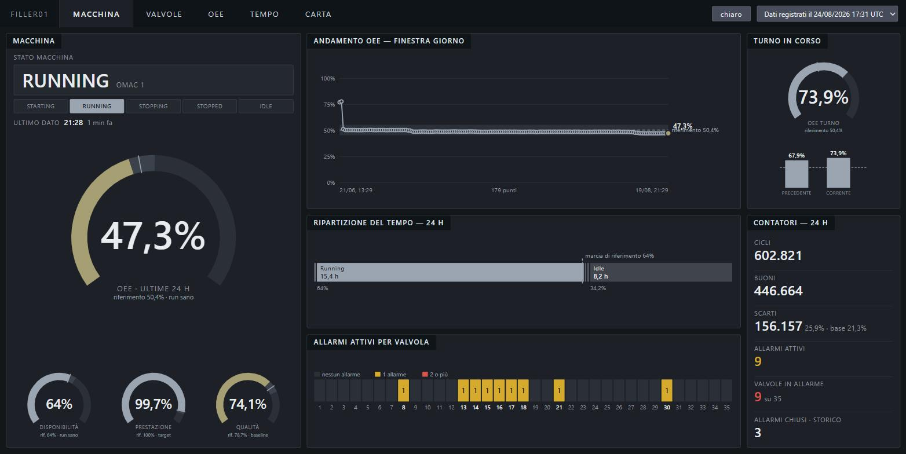
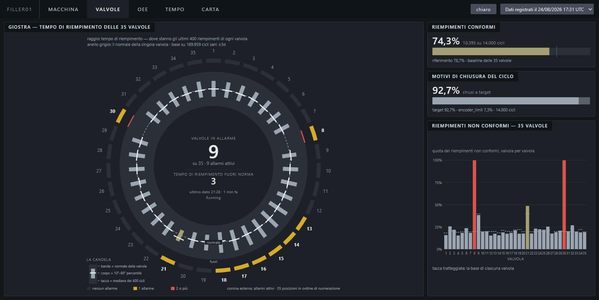
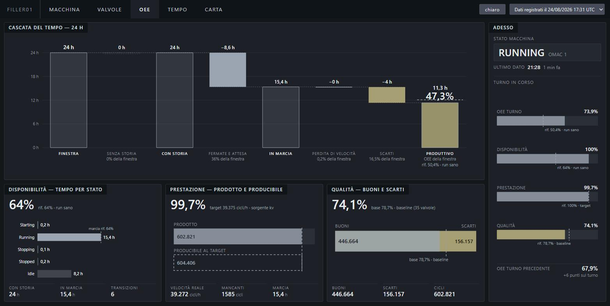
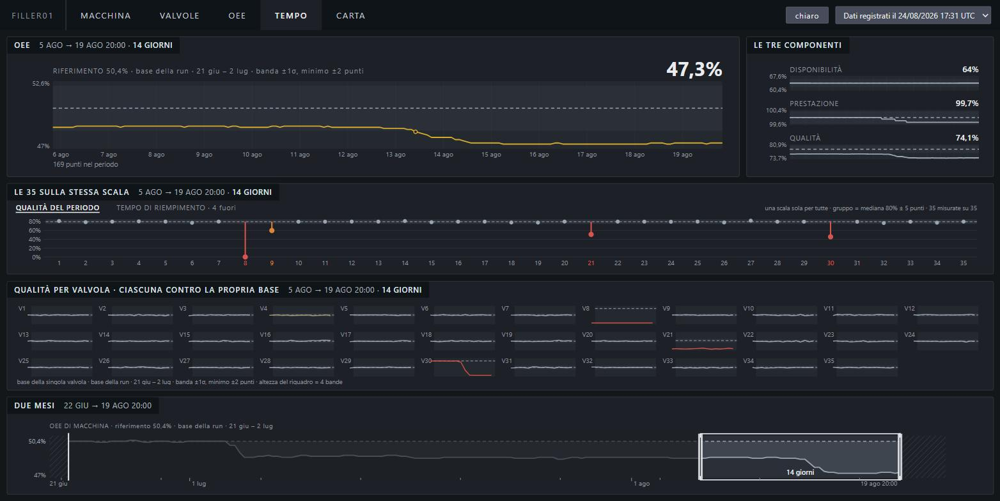

# FillerStack

[](LICENSE)
[](https://www.python.org/downloads/)
[](https://github.com/RazAndAlex/FillerStack/actions/workflows/test.yml)

The whole stack behind a rotary can-filler, from the valve to the screen.

```
process → sensors → virtual PLC → KPIs → telemetry → OPC UA → Node-RED
                                                                  ↓
   dashboard ← API ← alerts ← predictions ← features ← Parquet ← MQTT
```

Each stage knows only its input. The virtual PLC does not know which valve was
given a fault; the model does not know either; the alert engine sees only a
score. The simulator exists so you can score the diagnosis at the far end. It
knows the fault, and nothing downstream does.

The machine is a 35-valve carousel with 26 active filling positions.

**Two languages, on purpose.** The code and this README are in English. The
dashboard and [the site](https://razandalex.github.io/FillerStack/) are in
Italian, because the maintenance technicians who would use them are. If you
want the story before the source, start there.

## What you see

At the far end of the chain is a supervision screen for the people who keep
the machine running. It answers one question before any other, *how is the
machine doing*, and shows the rest only when you ask for it.



Four more pages sit behind it. Each answers the question the previous one
raises. All five run without a database. `dashboard.bat` replays a recorded
snapshot of the API's own responses.

| | | |
|---|---|---|
| [](dashboard/shots/02-valvole.jpg) | [](dashboard/shots/03-oee.jpg) | [](dashboard/shots/04-tempo.jpg) |
| **VALVOLE.** The carousel. 35 valves in their physical positions, each against its own band | **OEE.** The waterfall of the shift's time, and the three components against their reference | **TEMPO.** Fourteen days of trend, all 35 valves on one scale |

The fifth, [CARTA](dashboard/shots/05-carta.jpg), is the control chart. It
plots the single cycle and the 46-cycle mean, and gives a verdict per valve.

## The numbers

| | |
|---|---|
| Test suite | **567 passed** against a healthy PostgreSQL. **390 passed, 177 skipped** without one, in 20 minutes |
| Fault detection | **9 of 9** injected faults caught, on 9 of the 35 valves. **Zero** false positives on the other 26, across a full history of 723,110 predictions |
| Alert rule | a valve opens an alert when 5 of its last 150 predictions score at or above 0.5. It closes below 0.4 |
| Determinism | same seed → **byte-identical** Parquet (SHA-256, two weeks apart) |
| One simulated day | 604,398 cycles in 288 s, about 300× real time |
| Live chain, ten minutes | raw +193, cycles +187, predictions +3, all three stages alive |

## Quickstart

Python 3.14, and Docker only if you want the live chain. I pinned every
dependency to an exact version. The determinism fingerprint holds only inside
one environment, and a loose pin breaks it.

```bash
python -m venv .venv && .venv/Scripts/pip install -r requirements.txt
```

**See the dashboard.** Double-click `dashboard.bat`. You need nothing but
Python. With no database running it serves a recorded snapshot of the API's own
responses, and the selector at the top of the page carries the date the
snapshot was taken.

**Generate a day of data.**

```bash
.venv/Scripts/python -m plcsim.run --days 1 --seed 42 --out work/my_run
```

**Run the live chain.** Check the startup order with the preflight. It exits 0
when every check passed, 1 when one failed, and 2 when one could not be run at
all.

```bash
.venv/Scripts/python edge/scripts/preflight_live_run.py
```

**Run the tests.** Without a database you get the simulator, the ML pipeline
and the edge tests. Everything that needs PostgreSQL skips, and says why. For
all 567 you need the container, and you need it healthy. Check that before you
run. Against a container that is still starting, the database tests skip and
pytest still reports success.

```bash
.venv/Scripts/python -m pytest -q                    # no Docker: passes, DB tests skipped
docker inspect plcsim-postgres --format "{{.State.Health.Status}}"   # healthy
.venv/Scripts/python -m pytest -q                    # 567 passed
```

The full run takes about twenty minutes, and the first two of those go into
collecting the tests before one of them executes. The simulator tests generate
real runs.

**A note on the platform.** I wrote and ran all of this on Windows.
`dashboard.bat` and the `.venv/Scripts/` paths above are Windows, and the
launcher calls `kernel32.dll` to keep the console quiet. Nothing in the Python
is Windows-only as far as I know, but I have never run it on Linux or macOS, so
the commands above need translating and I cannot promise what breaks.

## Not production-ready

- **There is no prognosis.** The model reads 50 past cycles and labels the last
  one. That is a statement about the present. It answers "does this look
  wrong". It says nothing about how long the valve has left. I plan to add
  remaining useful life in a second version.
- **The 7-class fault classifier drives nothing.** What drives the alerts
  is `1 − P(healthy)` from the same model. The class label only puts a name on
  screen, and on one fault mode it disagrees with the alert. The dashboard
  puts the disagreement on screen.
- **Security is an accepted POC.** Plaintext broker, anonymous access, no OPC UA
  certificates. I logged it as out of scope, and I reopen it the day the chain
  leaves a single local machine.
- **One machine, one line, synthetic data.** Nothing here has run against real
  plant hardware.

## Where to start reading

**[Il viaggio del dato](https://razandalex.github.io/FillerStack/)**. Eleven
stops from the can to the screen, following one number: 2505 pulses, born
inside a can at 10:03 and read off a screen eleven handovers later. The page
explains every acronym before it uses one.

## What is in here

| Path | What it holds |
|---|---|
| `plcsim/` | The simulator: plant physics, sensors, virtual PLC, validation, scenarios, OPC UA server, the ML pipeline |
| `pipeline/` | MQTT ingestion, feature store, online inference, alert engine, PostgreSQL storage, the read-only API |
| `dashboard/` | The five supervision pages, the live server and the recorded-data server |
| `edge/` | Node-RED flows, Mosquitto and PostgreSQL compose, the live-run preflight, edge tests |
| `docs/` | Architecture decision records, the IIoT roadmap, an anonymised case study |
| `sito/` | The published site: sources, the four build scripts, the grammar it obeys |
| `scenarios/` | Fault scenario definitions. Each fault ramps up in severity over time |
| `tests/` | The simulator's tests. The rest of the suite lives next to what it covers, in `pipeline/tests/` and `edge/tests/` |
| `.project/` | Project memory: state, decisions, open questions, recent work |

The Python package is still called `plcsim`, and the containers still carry a
`plcsim-` prefix. That is deliberate. I renamed the project once the old name
started doing the wrong job. It named the simulator, and readers took the whole
thing for one. Internal identifiers do not have that job, and renaming them
would touch two frozen core files and break a persistent MQTT session for
nothing.

## Provenance

This is personal work, written on my own machine. It is not company work and
contains no company material.

It started from two things: datasets generated by an existing PLC simulator for
a machine of this kind, and a written description of how that simulator worked.
I never had its source code. An earlier project of mine tried to reproduce it by
fitting distributions to those datasets, and reached a statistical match without
recovering the underlying waveform.

This one does not work that way. It opens a valve, integrates a flow, and counts
pulses. The filling time and the tail time follow from that integration.
Nothing of the earlier generator survives here.

What does cross over is a calibration.
`plcsim/valve_params.csv` holds a statistical summary per valve of four
measured quantities: filling time, tail time, tail pulse and pulse count. The
code inverts the four means into each valve's physical constants, and carries
two of the standard deviations through into the calibration. It says how fast a
healthy valve fills. Three more constants come from the same reading: the 46-cycle driver period, the per-valve phase offset,
and the 250 ml recipe.

The original datasets are not in this repository and are not published with it.

## License

MIT. See [LICENSE](LICENSE).
